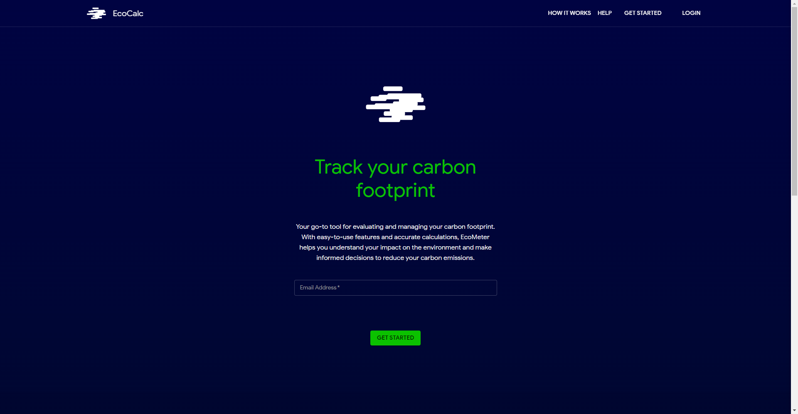

#
# EcoCalc
This is a tCO2e | ghg project bootstrapped with [`create-next-app`](https://github.com/vercel/next.js/tree/canary/packages/create-next-app). A go-to tool for evaluating and managing your carbon footprint. With easy-to-use features and accurate calculations, EcoCalc helps you understand your impact on the environment and make informed decisions to reduce your carbon emissions

Check it out [here](https://co2-calc-fe.vercel.app/).
#
### Screenshots

